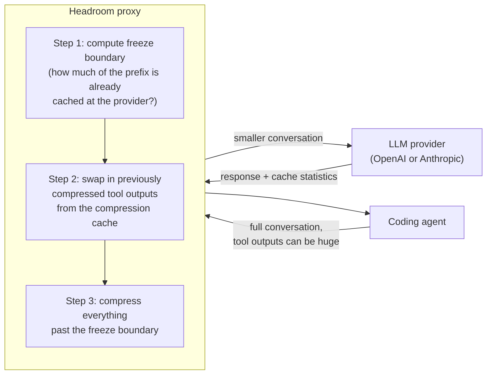
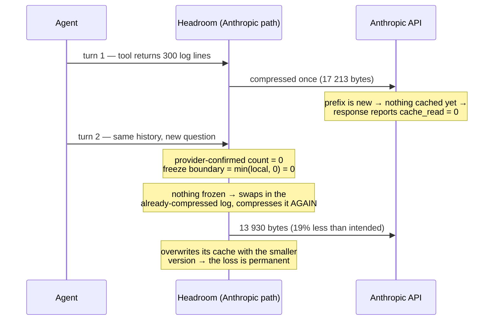
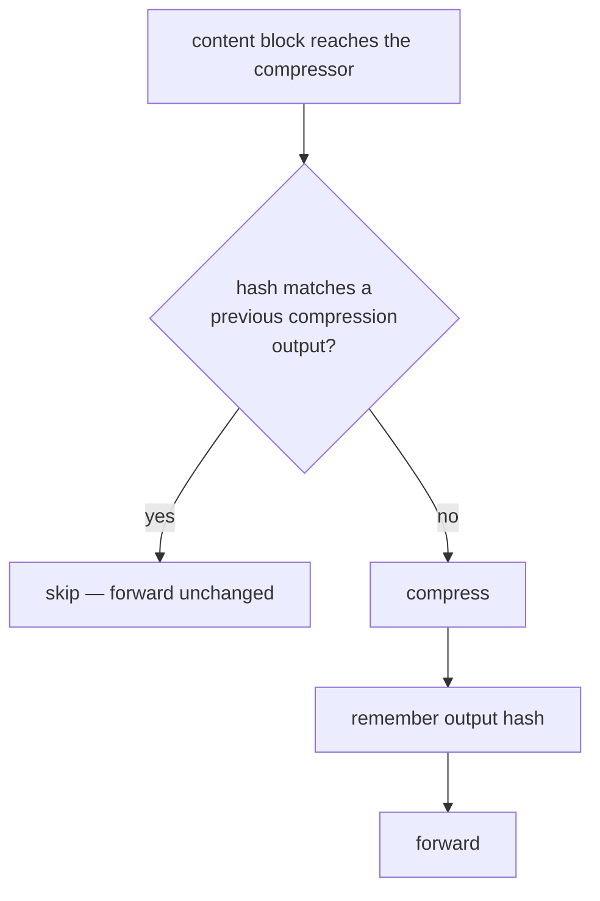

# Headroom Is Not Idempotent: Silent Re-Compression of Tool Outputs After a Prompt-Cache Lapse

**Abstract.** Headroom is an open-source proxy that reduces LLM costs by compressing large tool
outputs before they reach the model. We study one property its test suite never checks: compressing
already-compressed content should change nothing (*idempotence*). We built a multi-turn,
cross-provider test harness and found that this property fails on the Anthropic provider path.
Every large tool output is compressed a second time on the very next turn — before the provider has
had a chance to cache it — and Headroom overwrites its own cache with the smaller result, so the
loss is permanent. We trace the defect to a single line of code, implement a fix, and validate both
against the live Anthropic API with a real Claude agent. Across 12 live sessions the effect is
perfectly deterministic: unmodified Headroom forwards 19.1% fewer bytes than it intended in all six
baseline sessions, and the fix eliminates it in all six treatment sessions. A control arm falsified
our initial hypothesis that idle-induced cache expiry was the trigger, and we report that
correction. All headline results are reproducible; the deterministic benchmark needs no API key.

---

## 1. Introduction

Coding agents (Claude Code, Codex, aider) work in a loop: the model calls a tool, the tool's output
is appended to the conversation, and the whole conversation is re-sent for the next step. Tool
outputs run to tens of kilobytes and providers charge per token, so long sessions are expensive.

[Headroom](https://github.com/headroomlabs-ai/headroom) is a local proxy that intercepts this
traffic, compresses large tool outputs (for example keeping a representative sample of 300 log
lines), stores the original so the model can request it back, and forwards the smaller request.

Our question was simple: since the agent re-sends the *same* tool output every turn, what does
Headroom do the second time it sees content it already compressed? The correct answer is "nothing".
The actual answer is that it compresses its own output again, loses more information, and makes the
loss permanent.

Contributions:

1. **A property-based test harness** ([`research/harness/`](research/harness/)) that checks three
   invariants Headroom's existing tests cannot express: idempotence, equal behaviour on both
   provider paths, and stability across turns. It runs against fake providers, costs nothing, and
   is deterministic.
2. **A defect with its mechanism**, reduced to one line of code and one structural trigger: the
   turn following any newly introduced tool output, which occurs in every session.
3. **A fix** (~30 lines, flag-gated), validated over 12 live sessions against the real Anthropic
   API, where it removes a deterministic 19.1% loss.
4. **Two corrections to our own results**, both produced by controls: a hypothesis the data refuted,
   and a violation count that replication cut from five to three.

## 2. Background: how Headroom decides what to compress

Figure 1 shows the pipeline every request goes through.



*Figure 1. Normal operation. The freeze boundary exists to protect the provider's prompt cache.*

Two caches interact here, and the distinction is the heart of this paper.

**The provider's prompt cache.** Providers charge far less for a request prefix that is
byte-identical to the previous one, so Headroom must not rewrite a cached prefix. Each turn it
computes a *freeze boundary*: messages before it are forwarded untouched.

**Headroom's own compression cache.** Compressed outputs are stored and swapped back into later
requests (Step 2), so the compressor does not re-run on them — *provided they sit behind the freeze
boundary*.

The two provider paths compute the boundary differently, and this asymmetry is the defect. Each turn
produces two candidate numbers: a *local* count ("these leading tool outputs are ones I already
compressed — safe to freeze") and a *provider-confirmed* count derived from the cache statistics in
the previous response. The [OpenAI handler](headroom/proxy/handlers/openai.py) uses the local count.
The [Anthropic handler](headroom/proxy/handlers/anthropic.py) takes the minimum of both:

```python
frozen_message_count = min(frozen_message_count, cache_frozen_count)
```

The minimum is deliberate. An earlier version trusted local content-tracking alone and froze entire
conversations, disabling compression on 73% of requests (upstream issue #327); clamping to what the
provider actually confirmed fixed that. But it quietly created a new failure mode.

## 3. The defect

Consider any agent turn in which a tool returns a large output. Headroom compresses it and forwards
it. On the *next* turn the agent re-sends the same conversation — and Anthropic has not yet cached
that prefix, because it has never seen it before. Figure 2 shows what happens.



*Figure 2. The failure sequence. The freeze boundary was doing double duty as a "do not re-compress"
guard, and it is always zero on the turn right after a tool output arrives.*

The compressed log carries no marker saying "this is already compressed" — it looks like any other
log. Headroom does have a re-compression guard (added for upstream issue #1077), but it recognizes
compressed content only by a special retrieval marker that this content type never carries. So the
compressor samples the already-sampled lines down further, forwards the result, and overwrites the
cache entry.

**The trigger is structural, not incidental.** Our first hypothesis was that the defect needed an
idle gap long enough to expire Anthropic's ~5-minute prompt cache. A control arm disproved it
(§5.2): sessions with no idle gaps at all lose exactly the same 19.1%. The confirmed cache count is
zero on the turn following *any* newly introduced tool output, because a prefix the provider has
never received cannot have been cached. Every large tool output therefore gets compressed twice, in
every session. Conversely, later cache expiries cost nothing extra — by then the content has reached
a fixed point the compressor no longer shrinks.

**Why nobody saw it.** The repository has no test that compresses the same content twice and none
that compares the two provider handlers on one payload (`tests/parity/` compares the Python and Rust
compressor implementations, not the handlers). The
[bundled evaluation suite](research/result-02-existing-eval-suite.md) is single-turn. A defect
needing a *second* compression on *one* provider path is invisible to all of it.

## 4. The fix

The freeze boundary answers "what is cached upstream?". Idempotence needs a different question:
"have I produced these bytes myself?". The fix ([~30 lines in
`content_router.py`](headroom/transforms/content_router.py), enabled by
`HEADROOM_IDEMPOTENT_COMPRESSION=1`, default off) asks it directly, as shown in Figure 3.



*Figure 3. The idempotence guard. Every compression output is remembered by hash; content matching a
remembered hash is never compressed again. The freeze boundary is untouched, so the issue-#327 fix
is preserved.*

## 5. Evaluation

We evaluate on two benchmarks that trade off against each other. The first is deterministic and
free, so it can sweep a large configuration space and be replicated exactly; the second uses a real
agent against the real provider, so it has external validity but few samples. Neither is sufficient
alone, and where they disagree we report both (§5.3).

**Common measurement.** Both measure the same dependent variable: **the bytes Headroom actually
forwards to the provider** for one tool output, captured by a recording proxy — not Headroom's own
statistics, because the question is what the model receives. Payloads embed unique probe tokens, so
we also count surviving items.

**Common protocol.** Turn 1 delivers a large tool output; every later turn adds a question and **no
new information**. Under idempotence the forwarded output must be byte-identical on every turn.

| | Deterministic benchmark (§5.1) | Live agent benchmark (§5.2) |
|---|---|---|
| Provider | fake, scripted cache statistics | real `api.anthropic.com` |
| Model | none | `claude-sonnet-4-5` |
| Independent variables | provider path, cache regime, content type, arm | arm, idle pattern |
| Samples | 72 cells × 5 passes = 360 cell-runs | 3 runs × 3 arms = 9 sessions |
| Controls | warm-cache regime; OpenAI path; fix arm | no-idle control; fix arm |
| Cost | $0, no API key | ~9 × 20 min, real API spend |
| Purpose | mechanism, scope, reproducibility | external validity, effect size |

**Reproduction.** `./research/run_deterministic.sh 5` and `./research/run_live_ab.sh 5` regenerate
every number below. Both refuse to start while the other is running, because the sweep is
timing-sensitive.

### 5.1 Deterministic property benchmark (synthetic, $0)

The harness drives full multi-turn conversations through a real Headroom proxy into fake providers
that report cache statistics the way real ones do. Matrix: 2 provider paths × 3 cache regimes
(always-cold, always-warm, intermittent) × 2 arms × 6 content types × 10 turns = 72 cells per pass.
Each turn re-sends the same tool output and asks a new question.

Two rules protect the results. Cells where compression never fired are excluded as *vacuous* (16 of
72) — they satisfy idempotence while testing nothing. And **the full matrix is run five times**; a
verdict counts only if all five passes agree. Cells that disagree are reported as *flaky* and never
counted as passing. This rule earns its keep: at three passes the harness reported 5 stable
violations and 4 flaky cells; at five passes it reports **3 stable violations and 6 flaky cells**.
Two "violations" we would have published were not reproducible.

Over 360 cell-runs: 47 cells stably hold, 3 stably violate, 6 are flaky, and **every violation and
every flaky cell is on the Anthropic path with the fix off**. The OpenAI path and the fix arm are
stable in all five passes.

| cache regime | content type | items surviving | forwarded bytes (payload) |
|---|---|---|---|
| cold | log lines | 300 → 62 (all 5 passes) | 18 323 → 3 904 (22 509) |
| cold | search results | 300 → 300 (all 5) | 13 432 → 7 965–8 118 (20 009) |
| intermittent | log lines | 300 → 62 in 4/5, 300 in 1/5 | 18 323 → 3 904 or 17 760 (22 509) |

*Table 1. The three stable violations, n=5 passes. The search-results row is a violation class that
content-based checks miss entirely: every probe item survives while ~40% of the bytes disappear. The
intermittent row shows the effect is real but its magnitude is not always stable.*

The 6 flaky cells are a finding in their own right: on the unmodified Anthropic path, identical
input can produce different compression output across runs (e.g. a numeric array retaining 15 items
in three passes and 9 in two). The fix arm exhibits no flakiness in any pass.

### 5.2 Live agent benchmark (real Claude, real Anthropic API)

Each session gets a **fresh proxy and recorder**, so Headroom's compression cache never carries
between replicates. Three arms: `baseline` and `fixed` with 330 s idle gaps, and a
`no-idle` control in which the prompt cache is never allowed to expire.

| arm | n | forwarded bytes, turn 1 → final | Δ | probe survived | accuracy |
|---|---|---|---|---|---|
| unmodified, idle gaps | 1 | 17 213 → 13 930 | **−19.1%** | 1/1 | 4/4 |
| unmodified, **no idle (control)** | 5 | 17 213 → 13 930 | **−19.1%** | 5/5 | 20/20 |
| fix enabled, idle gaps | 1 | 17 213 → 17 213 | 0.0% | 1/1 | 4/4 |
| fix enabled, **no idle** | 5 | 17 213 → 17 213 | 0.0% | 5/5 | 20/20 |

*Table 2. Live A/B, 12 sessions. Byte counts are identical to the digit in every session of an arm —
the effect is deterministic, not an average.*

**The control falsified our hypothesis, and strengthened the result.** We predicted the no-idle arm
would show no loss, because we believed cache expiry was the trigger. It shows exactly the same
−19.1%. Inspecting per-turn cache statistics explains why: in the no-idle arm Anthropic reports
`cache_read = 0` on turn 2 only — the one turn where the tool output is new — and the loss happens
precisely there. In the idle arm there are three such zero-read turns, and the loss still happens
only at the first. The trigger is the introduction of new content, not the expiry of old cache, so
the defect fires once in *every* session rather than only in idle ones. This makes the defect more
general than we first claimed while making each session's damage bounded.

**On accuracy.** No arm lost a queried item: 48/48 answers correct across all sessions. The fix
preserves fidelity, but this benchmark had no accuracy to rescue, because the compressor's first
pass already retained all 300 probe lines. Demonstrating an accuracy effect would need payloads
where the second compression removes an item the task depends on — future work (§7).

**On magnitude.** The synthetic benchmark predicted losses up to 79% of retained content (Table 1,
log lines). Live, the loss is 19.1%. We quote only the live figure as the field estimate and treat
Table 1 as an upper bound on a rig.

## 6. Secondary findings

**A query-aware compression extension that works in the lab and not in the field.** Headroom ranks
items by relevance to the user's question when compressing arrays of JSON objects, but silently
ignores the question for arrays of plain strings or numbers, where survival of the item the user
asked about is chance (measured: 28% for interior items). We
[implemented](crates/headroom-core/src/transforms/smart_crusher/crushers.rs) BM25-based query-aware
retention for that path (~140 lines of Rust, flag-gated): retention rises to 100% at 4.3% *lower*
token cost, with no regression on control tasks where relevance is the wrong criterion. In
production the effect is [null](research/result-06-in-vivo-null.md): real agent tool output is
routed to a different (text) compressor by design and never reaches the improved path. We report the
null in full; watching forwarded bytes during this experiment is how the idempotence defect was
noticed.

**Unexplained nondeterminism.** Four harness cells changed verdict between identical runs — all on
the unmodified Anthropic path; the fix arm is fully deterministic. If compression output genuinely
varies run-to-run, it breaks the byte-identical prefixes that prompt caching requires, which would
be a larger problem than the one we fixed. We characterize this but did not diagnose it.

**Cross-provider divergence.** The two paths also disagree on *whether* to compress: the same
search-results payload is compressed to 13 432 bytes on the Anthropic path and forwarded untouched
(20 009 bytes) on the OpenAI path.

## 7. Threats to validity

*Internal.* Our first "warm cache" control was invalid — the fake provider reported too few cached
tokens to clear Headroom's 1 024-token activation threshold, so the freeze boundary stayed at zero
for a reason unrelated to the hypothesis. We caught this with tracing, rebuilt the control with a
realistic 20 KB system prompt, and the conclusion changed: the decay is *conditional on cache
misses*, not universal. An early violation count was also inflated by the flaky cells. Both
retractions are preserved in the [research log](research/INDEX.md).

*External.* The live evaluation is one scenario: one content type, one model, one idle pattern, one
run per arm. It establishes existence and mechanism, not prevalence; a benchmark suite in which task
success depends on interior tool-output items remains future work. The harness payloads are
synthetic, and its cache statistics are simulated (calibrated to the fields and thresholds the code
actually reads).

*Construct.* The fix arm is our own patch evaluated by our own harness. The baseline arm is
unmodified upstream, the fix is default-off, and everything is scripted for independent replication.

*Confirmation.* The full test suite was run on our tree and on pristine upstream (`7ef736fb`) in
separate worktrees: 11 000 vs. 11 002 passing with identical failure sets (8 pre-existing failures;
our one extra was a missing `cargo` on `PATH` and passes with it present). Our changes introduce no
regressions.

## 8. Conclusion

A compression proxy for LLM conversations must be idempotent, because agents re-send the same
content every turn and cache lapses are routine. Headroom's Anthropic path is not: one defensible
line of code (`min` of two freeze counts) lets a prompt-cache lapse expose already-compressed
content to the compressor again, and the loss is silent and permanent. The property harness that
found this checks a class of invariant — behaviour across turns and across providers — that the
project's existing tests structurally cannot, and it found real defects on first use. The fix is
small, preserves the prior bug-fix it interacts with, and holds up against the live API.

---

## Appendix: reproducing

Headline results, no API key needed (~8 min per pass):

```bash
for r in 1 2 3; do
  python3 research/harness/property_sweep.py --turns 10 --items 300 \
      --out research/data/property_sweep_r$r.json
done
python3 research/harness/aggregate_repeats.py research/data/property_sweep_r*.json

python3 research/repro/qcr_harness.py     # secondary finding: query-aware retention
```

The live A/B ([`agent_anthropic_bench.py`](research/repro/agent_anthropic_bench.py)) needs an
Anthropic API key and ~35 minutes, most of it deliberate idling. Raw data for every table is in
[`research/data/`](research/data/); the full evidence log, including nulls and retracted controls,
is indexed in [`research/INDEX.md`](research/INDEX.md).
